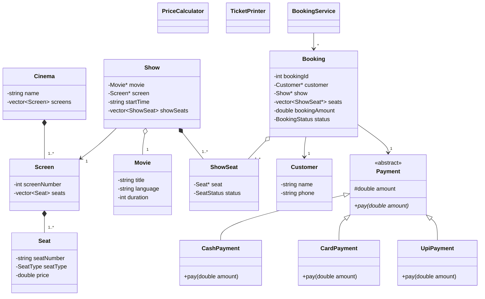
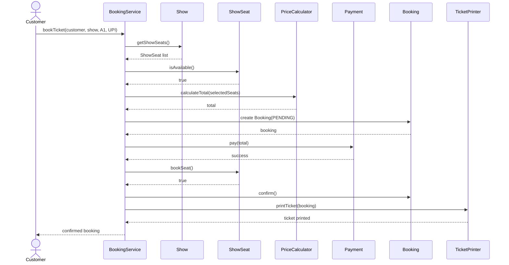

# Relationships and UML

| Relationship | Type | Multiplicity | Reason |
| --- | --- | --- | --- |
| Cinema → Screen | Composition | 1 → 1..* | Cinema owns its screens |
| Screen → Seat | Composition | 1 → 1..* | Screen owns its physical seats |
| Show → Movie | Aggregation | * → 1 | Show refers to an existing movie |
| Show → Screen | Association | * → 1 | Show is scheduled on one screen |
| Show → ShowSeat | Composition | 1 → 1..* | Show owns its show-specific seat states |
| Booking → Customer | Association | * → 1 | Booking belongs to a customer |
| Booking → ShowSeat | Aggregation | 1 → 1..* | Booking refers to selected show seats |
| Booking → Payment | Association | 1 → 1 | Booking uses a payment object |
| Payment → UpiPayment/CardPayment/CashPayment | Inheritance | — | Concrete payment implementations |
| BookingService → Booking | Association | 1 → * | Service manages bookings |

# Class Diagram

# Sequence Diagram

**Use case: customer books 1 seat and pays by UPI.**

